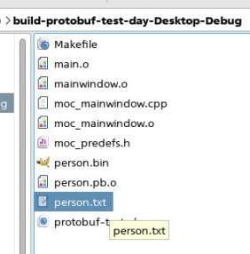

Подключение библиотеки protobuf и хэдеров
```c++
INCLUDEPATH += /usr/include \
                /usr/include/x86_64-linux-gnu \
                /usr/include/c++/8
LIBS += -L/usr/lib/x86_64-linux-gnu -lprotobu
```

Создание прото файла (person.proto) в корне проекта, в котором описывается структура данных
```c++
syntax = "proto3";

message Person {
    string name = 1;
    int32 id = 2;
    string email = 3;
}
```

Переходим в директорию с проектом и с помощью компилятора protoc генерируем с++ код (хэдер и cpp), для работы с данными из прото файла

```c++
protoc --cpp_out=. person.proto
```

После этого сгенерируются два файла:
person.pb.h и preson.pb.cc, которые нужно подключить 

```c++
SOURCES += \
    main.cpp \
    mainwindow.cpp \
    person.pb.cc

HEADERS += \
    mainwindow.h \
    person.pb.h
```


## Ui для ввода данных


После сериализации получается бинарный файл, содержащий представление данных в бинарном виде


Для корректного отображения, бинарный файл нужно открывать с помощью утилиты Hexdump

```c++
hexdump -c "person.bin"
```


После десериализации создастся txt файл, содержащий десериализованные данные из сгенерированного ранее бинарного




